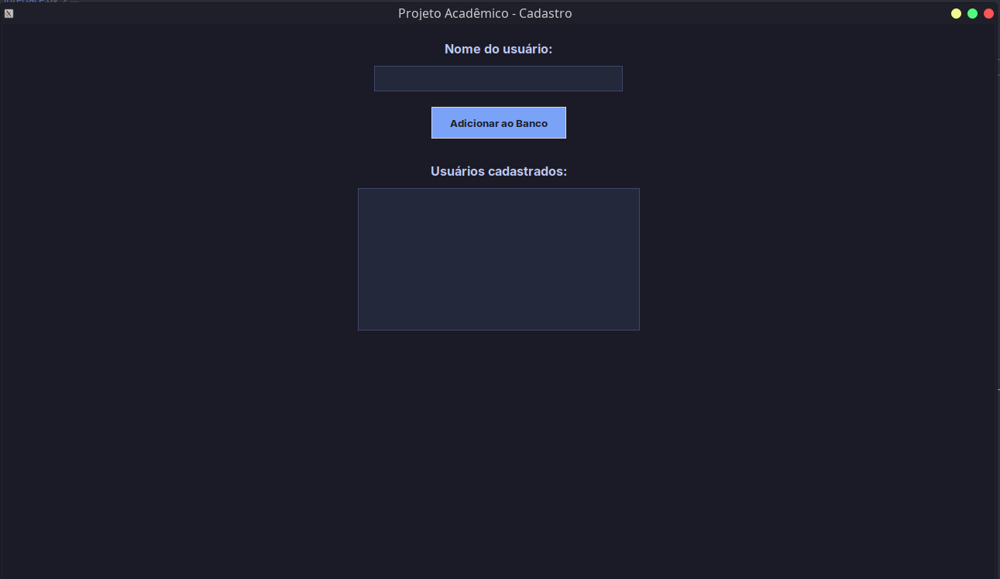
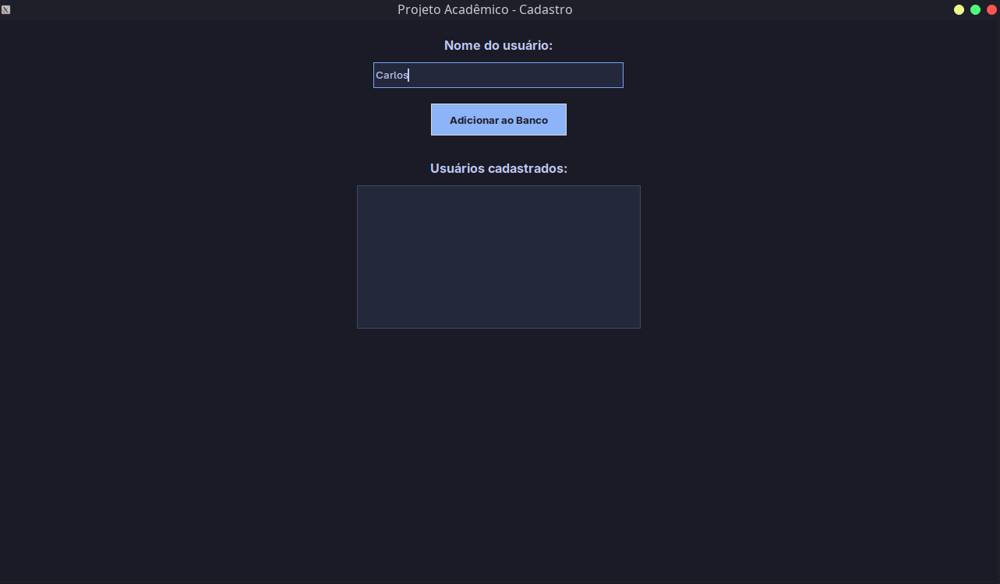
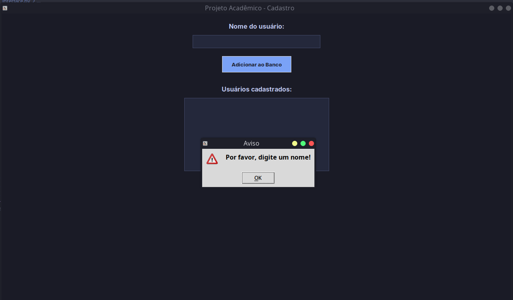
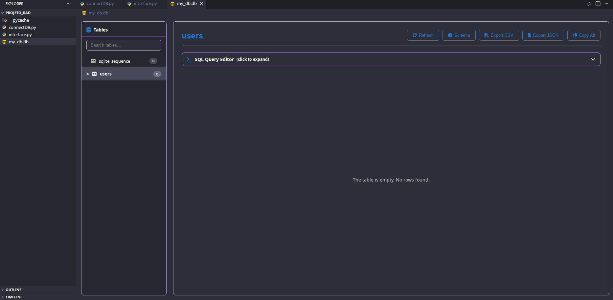
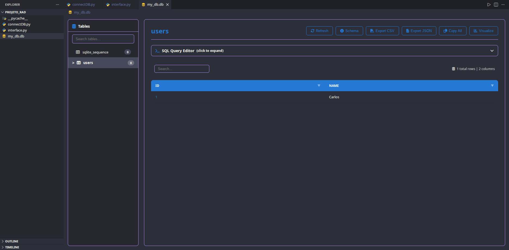

# 📝 Projeto Acadêmico - Cadastro de Usuários

## 📖 Sobre o Projeto
Este é um projeto acadêmico desenvolvido com o objetivo de criar um sistema simples de cadastro de usuários. Ele serve para demonstrar, na prática, como conectar uma **interface gráfica** (as telinhas com botões e campos de texto que o usuário vê) a um **banco de dados** (o lugar onde as informações ficam salvas permanentemente).

O projeto foi pensado para ser fácil de usar e possui um visual moderno com "Modo Escuro" (Dark Theme).

## ✨ O que o projeto faz? (Funcionalidades)
- **Adicionar Usuário:** Você digita um nome na caixa de texto, clica no botão, e ele é salvo no banco de dados.
- **Listar Usuários:** Logo abaixo do botão, há uma lista que mostra em tempo real todos os nomes que já foram cadastrados.
- **Proteção contra erros:** Se você esquecer de digitar um nome e tentar salvar mesmo assim, o sistema não deixa o aplicativo quebrar e exibe uma janela de aviso amigável.

## 🛠️ Tecnologias Utilizadas
Aqui estão as ferramentas usadas para construir este projeto, explicadas de forma simples:

* **Python:** A linguagem de programação principal usada para dar "vida" ao projeto.
* **Tkinter:** Uma biblioteca (um conjunto de ferramentas) nativa do Python. Foi usada para desenhar toda a parte visual do projeto, como a janela, as cores, o botão e a caixa de digitação.
* **SQLite (`sqlite3`):** É o banco de dados. Ele é muito prático porque salva todas as informações diretamente em um pequeno arquivo no seu computador (chamado `my_db.db`), sem precisar instalar servidores complexos.

---

## 📸 Como o projeto se parece (Telas)

Aqui estão algumas imagens mostrando o sistema funcionando:

### 1. Tela Inicial
Esta é a tela principal assim que você abre o aplicativo, pronta para receber um novo nome.


### 2. Cadastrando um novo usuário
Aqui vemos o sistema em uso, com um nome ("Carlos") sendo digitado na caixa de texto, prestes a ser salvo.


### 3. Tratamento de Erro (Aviso)
Se o usuário clicar no botão "Adicionar ao Banco" sem ter digitado nada, o sistema exibe este alerta na tela para orientá-lo.


### 4. Banco de Dados Vazio
Uma visão dos bastidores: aqui está a estrutura do banco de dados antes de qualquer nome ser cadastrado (a tabela está vazia).


### 5. Banco de Dados Atualizado
Após adicionar o nome no aplicativo, podemos ver nos bastidores que o dado foi salvo com sucesso no banco de dados, recebendo um "ID" (um número de identificação único).


---

## 🚀 Como testar este projeto no seu computador

Se você quiser rodar este projeto, é bem simples:

1. **Pré-requisito:** Você precisa ter o **Python** instalado no seu computador.
2. Baixe os arquivos deste repositório para uma pasta no seu computador.
3. Certifique-se de que os arquivos `interface.py` e `connectDB.py` estão na mesma pasta.
4. Abra o terminal (ou prompt de comando) nessa pasta.
5. Digite o seguinte comando e aperte Enter:

```bash
python interface.py
